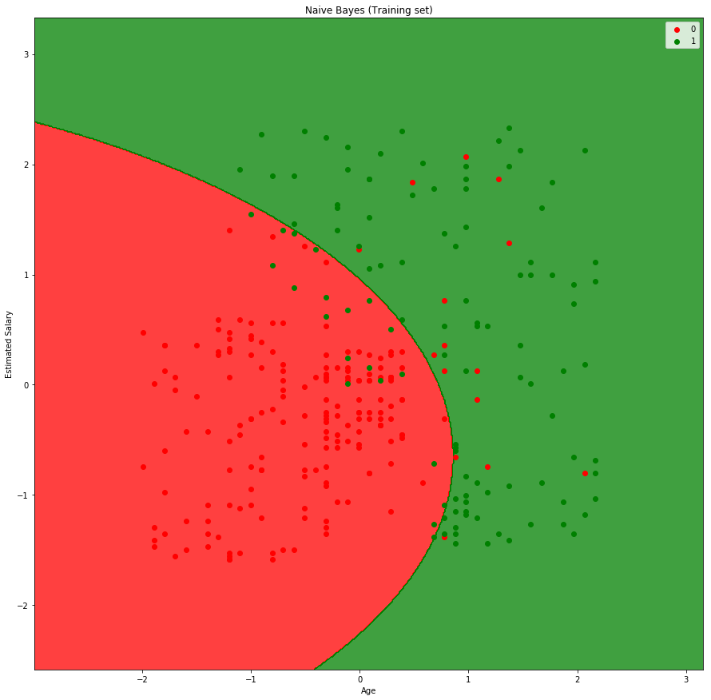

# Gaussian Naive Bayes


```python
# Importing the libraries
import numpy as np
import matplotlib.pyplot as plt
import pandas as pd
```

## Importing the dataset

The aim is to construct a classifier that predicts whether a user will buy a new SUV given information of his/her Age and Salary.


```python

dataset = pd.read_csv('Social_Network_Ads.csv')
X = dataset.iloc[:, [2, 3]].values
y = dataset.iloc[:, 4].values
```

## Splitting the dataset into the Training set and Test set


```python
from sklearn.model_selection import train_test_split
X_train, X_test, y_train, y_test = train_test_split(X, y, test_size = 0.25, random_state = 0)

```

## Feature Scaling


```python
from sklearn.preprocessing import StandardScaler
sc = StandardScaler()
X_train = sc.fit_transform(X_train)
X_test = sc.transform(X_test)
```

    /home/josue/.virtualenvs/is/lib/python3.6/site-packages/sklearn/utils/validation.py:595: DataConversionWarning: Data with input dtype int64 was converted to float64 by StandardScaler.
      warnings.warn(msg, DataConversionWarning)
    /home/josue/.virtualenvs/is/lib/python3.6/site-packages/sklearn/utils/validation.py:595: DataConversionWarning: Data with input dtype int64 was converted to float64 by StandardScaler.
      warnings.warn(msg, DataConversionWarning)
    /home/josue/.virtualenvs/is/lib/python3.6/site-packages/sklearn/utils/validation.py:595: DataConversionWarning: Data with input dtype int64 was converted to float64 by StandardScaler.
      warnings.warn(msg, DataConversionWarning)


```python
# Fitting Naive Bayes to the Training set
from sklearn.naive_bayes import GaussianNB
classifier = GaussianNB()
classifier.fit(X_train, y_train)

```


    GaussianNB(priors=None, var_smoothing=1e-09)


## Predicting the Test set results


```python
y_pred = classifier.predict(X_test)

```

## Making the Confusion Matrix


```python
from sklearn.metrics import confusion_matrix
cm = confusion_matrix(y_test, y_pred)

print(cm, y_pred)
```

    [[65  3]
     [ 7 25]] [0 0 0 0 0 0 0 1 0 1 0 0 0 0 0 0 0 0 1 0 0 1 0 1 0 1 0 0 0 0 0 0 1 0 0 0 0
     0 0 1 0 0 0 0 1 0 0 1 0 1 1 0 0 1 1 0 0 0 1 0 0 1 0 0 0 1 0 0 0 0 1 0 0 0
     0 0 0 0 1 1 1 1 0 0 1 0 0 1 0 0 0 1 0 0 0 0 0 1 1 1]


## Visualising the Training set results


```python
# larger graph 
width = 15
height = 15
plt.figure(figsize=(width, height))
from matplotlib.colors import ListedColormap
X_set, y_set = X_train, y_train
X1, X2 = np.meshgrid(np.arange(start = X_set[:, 0].min() - 1, stop = X_set[:, 0].max() + 1, step = 0.01),
                     np.arange(start = X_set[:, 1].min() - 1, stop = X_set[:, 1].max() + 1, step = 0.01))
plt.contourf(X1, X2, classifier.predict(np.array([X1.ravel(), X2.ravel()]).T).reshape(X1.shape),
             alpha = 0.75, cmap = ListedColormap(('red', 'green')))
plt.xlim(X1.min(), X1.max())
plt.ylim(X2.min(), X2.max())
for i, j in enumerate(np.unique(y_set)):
    plt.scatter(X_set[y_set == j, 0], X_set[y_set == j, 1],
                c = ListedColormap(('red', 'green'))(i), label = j)
plt.title('Naive Bayes (Training set)')
plt.xlabel('Age')
plt.ylabel('Estimated Salary')
plt.legend()
plt.show()

```

    'c' argument looks like a single numeric RGB or RGBA sequence, which should be avoided as value-mapping will have precedence in case its length matches with 'x' & 'y'.  Please use a 2-D array with a single row if you really want to specify the same RGB or RGBA value for all points.
    'c' argument looks like a single numeric RGB or RGBA sequence, which should be avoided as value-mapping will have precedence in case its length matches with 'x' & 'y'.  Please use a 2-D array with a single row if you really want to specify the same RGB or RGBA value for all points.





## Visualising the Test set results


```python
# larger graph 
width = 15
height = 15
plt.figure(figsize=(width, height))
from matplotlib.colors import ListedColormap
X_set, y_set = X_test, y_test
X1, X2 = np.meshgrid(np.arange(start = X_set[:, 0].min() - 1, stop = X_set[:, 0].max() + 1, step = 0.01),
                     np.arange(start = X_set[:, 1].min() - 1, stop = X_set[:, 1].max() + 1, step = 0.01))
plt.contourf(X1, X2, classifier.predict(np.array([X1.ravel(), X2.ravel()]).T).reshape(X1.shape),
             alpha = 0.75, cmap = ListedColormap(('red', 'green')))
plt.xlim(X1.min(), X1.max())
plt.ylim(X2.min(), X2.max())
for i, j in enumerate(np.unique(y_set)):
    plt.scatter(X_set[y_set == j, 0], X_set[y_set == j, 1],
                c = ListedColormap(('red', 'green'))(i), label = j)
plt.title('Naive Bayes (Test set)')
plt.xlabel('Age')
plt.ylabel('Estimated Salary')
plt.legend()
plt.show()
```

    'c' argument looks like a single numeric RGB or RGBA sequence, which should be avoided as value-mapping will have precedence in case its length matches with 'x' & 'y'.  Please use a 2-D array with a single row if you really want to specify the same RGB or RGBA value for all points.
    'c' argument looks like a single numeric RGB or RGBA sequence, which should be avoided as value-mapping will have precedence in case its length matches with 'x' & 'y'.  Please use a 2-D array with a single row if you really want to specify the same RGB or RGBA value for all points.


## Excercise: Try your own Gaussian Naive Bayes algorithm 

- Hint: compute the mean and standard deviation for each class value and variable|class

- Use a Gaussian function to estimate the probability of a specific attribute value. To do so, you can use the mean and standard deviation computed for that attribute from the training data.

- You should obtain the same confusion matrix of sklearn algorithm


## Naive Bayes classifier

Now, we are going to implement our own naive bayes implementation. For this case we are going to use the gauss function. All the functions are based using: https://en.wikipedia.org/wiki/Naive_Bayes_classifier#Gaussian_naive_Bayes


```python
import math
import operator

from collections import defaultdict


def mean(numbers):
    n = len(numbers)
    return float(sum(numbers)) / n


def stdev(numbers):
    avg = mean(numbers)
    n = len(numbers)
    sum_diff = sum([pow(x - avg, 2) for x in numbers])
    return math.sqrt(float(sum_diff) / (n - 1))


def gauss(x, mean, stdev):
    """
    rename to gauss
    """

    exponent = math.exp(
        -(math.pow(x - mean, 2) / (2 * math.pow(stdev, 2))))
    return (1 / (math.sqrt(2 * math.pi) * stdev)) * exponent


class NaiveBayes(object):
    def __init__(self):
        self.probabilities = {}
        self.prob_y = defaultdict(float)

    def train(self, X, Y):
        dim_X = len(X[0])
        size_data = len(X)
        factor_size = float(1) / size_data
        class_attrs = {i: [[] for j in range(dim_X)] for i in set(Y)}

        for x, y in zip(X, Y):
            self.prob_y[y] += factor_size
            for i, attr in enumerate(x):
                class_attrs[y][i].append(attr)

        for k, attrs in class_attrs.items():
            probability = []
            for i, attr in enumerate(attrs):
                probability.append({
                    'mean': mean(attr),
                    'stdev': stdev(attr),
                })
            self.probabilities[k] = probability

    def predict(self, X):
        if not self.probabilities:
            print("You should train the model before")
            return

        posteriors = {}
        evidence = 0
        for k, prob in self.probabilities.items():
            post = self.prob_y[k]
            for i, x in enumerate(X):
                mean, stdev = prob[i]['mean'], prob[i]['stdev']
                post *= gauss(x, mean, stdev)
            posteriors[k] = post
            evidence += post
        for k, v in posteriors.items():
            posteriors[k] = v / evidence
        return max(posteriors.items(), key=operator.itemgetter(1))[0]
    
    def predict_list(self, L):
        return [self.predict(i) for i in L]
        
```


```python
X_train, X_test, y_train, y_test = train_test_split(X, y, test_size = 0.25, random_state = 0)
```


```python
model = NaiveBayes()
model.train(X_train, y_train)
```

We can check the means and standard deviation of each attribute


```python
model.probabilities
```


    {0: [{'mean': 33.507936507936506, 'stdev': 7.8460038938513375},
      {'mean': 60179.89417989418, 'stdev': 24623.104052499802}],
     1: [{'mean': 45.990990990990994, 'stdev': 8.591216969033491},
      {'mean': 85594.5945945946, 'stdev': 42397.97987862981}]}


```python
y_predict =[model.predict(x) for x in X_test]
```


```python
cm = confusion_matrix(y_test, y_predict)
```


```python
cm
```


    array([[65,  3],
           [ 7, 25]])


We can check here that the confusion matrix is the same
